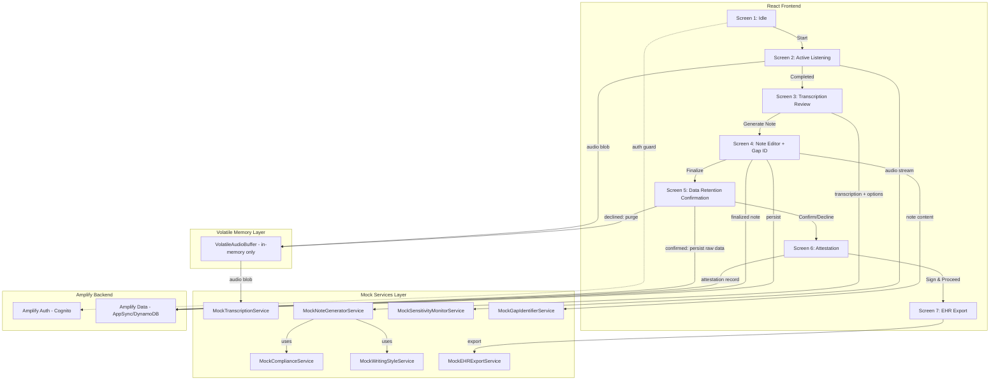
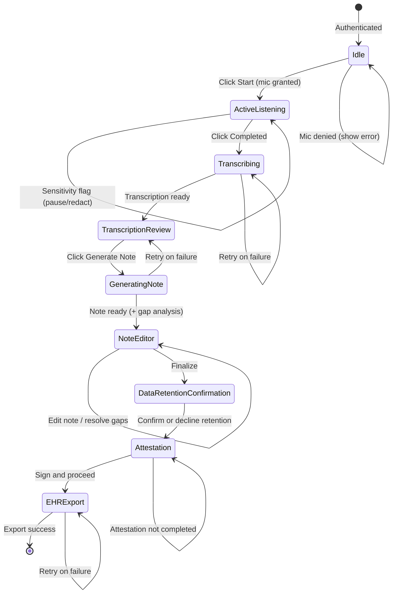

# Design Document: Ambient Clinical Notes

## Overview

Ambient Clinical Notes is a seven-screen React feature built on top of the existing Vite + TypeScript + AWS Amplify stack. It enables healthcare providers to capture patient encounters via ambient audio with real-time sensitivity monitoring, review transcriptions, apply compliance transformations, generate structured clinical notes with agentic gap identification, formally attest to notes, and export to EHR systems. Raw audio and transcription data is held in volatile memory by default and purged unless the clinician explicitly confirms retention.

All backend services (speech-to-text, note generation, compliance transformation, writing style analysis, sensitivity monitoring, gap identification, and EHR export) are implemented as dummy/mock services returning realistic simulated data. No real API integrations are required. This allows full UI development and testing without external dependencies.

The feature uses React Router for screen navigation, React Context for shared session state, and the existing Amplify Auth for authentication gating. Data persistence uses the Amplify Data (AppSync + DynamoDB) backend with owner-based authorization. A volatile in-memory buffer holds raw data during sessions, with explicit clinician confirmation required before any raw data is persisted.

## Architecture



### Screen Flow



## Components and Interfaces

### Screen Components

| Component | Path | Description |
|---|---|---|
| `IdleScreen` | `src/features/ambient-notes/screens/IdleScreen.tsx` | Start button, mic permission handling |
| `ActiveListeningScreen` | `src/features/ambient-notes/screens/ActiveListeningScreen.tsx` | Pulsing animation, Pause/Resume/Completed buttons, real-time sensitivity flags with pause/redact actions |
| `TranscriptionReviewScreen` | `src/features/ambient-notes/screens/TranscriptionReviewScreen.tsx` | Transcription display, compliance toggle, template toggle, writing style toggle, Generate Note button |
| `NoteEditorScreen` | `src/features/ambient-notes/screens/NoteEditorScreen.tsx` | Template-based or blank editor, compliance highlights, recommended sentences, gap notification panel |
| `DataRetentionScreen` | `src/features/ambient-notes/screens/DataRetentionScreen.tsx` | Volatile data retention confirmation prompt; defaults to "do not save" |
| `AttestationScreen` | `src/features/ambient-notes/screens/AttestationScreen.tsx` | Read-only note review, attestation checkbox, "Sign and Proceed" button |
| `EHRExportScreen` | `src/features/ambient-notes/screens/EHRExportScreen.tsx` | EHR system selection, export confirmation |

### Shared UI Components

| Component | Path | Description |
|---|---|---|
| `PulsingCircle` | `src/features/ambient-notes/components/PulsingCircle.tsx` | CSS-animated pulsing circle for active listening |
| `ComplianceHighlight` | `src/features/ambient-notes/components/ComplianceHighlight.tsx` | Highlighted span with tooltip showing original term |
| `TemplateDropdown` | `src/features/ambient-notes/components/TemplateDropdown.tsx` | Dropdown for template selection |
| `RecommendedSentence` | `src/features/ambient-notes/components/RecommendedSentence.tsx` | Clickable sentence chip that inserts into editor |
| `LoadingIndicator` | `src/features/ambient-notes/components/LoadingIndicator.tsx` | Shared loading spinner for async operations |
| `ErrorRetry` | `src/features/ambient-notes/components/ErrorRetry.tsx` | Error message with retry button |
| `SensitivityFlag` | `src/features/ambient-notes/components/SensitivityFlag.tsx` | Visual alert for detected sensitive topics during recording, with pause and flag-for-redaction actions |
| `GapNotificationPanel` | `src/features/ambient-notes/components/GapNotificationPanel.tsx` | Panel listing documentation gaps with severity badges and suggested text additions |
| `GapItem` | `src/features/ambient-notes/components/GapItem.tsx` | Individual gap entry with description, severity, and "Add Suggestion" action |
| `AttestationForm` | `src/features/ambient-notes/components/AttestationForm.tsx` | Attestation statement, checkbox, and "Sign and Proceed" button |
| `DataRetentionPrompt` | `src/features/ambient-notes/components/DataRetentionPrompt.tsx` | Confirmation dialog for volatile data retention with "Save Raw Data" and "Purge" options |

### Mock Services

All mock services live in `src/features/ambient-notes/services/` and return Promises with simulated delays (500-2000ms) to mimic real API behavior.

```typescript
// src/features/ambient-notes/services/mockTranscriptionService.ts
interface TranscriptionResult {
  text: string;
  segments: { start: number; end: number; text: string }[];
}

export function transcribeAudio(audioBlob: Blob): Promise<TranscriptionResult>;
```

Returns a realistic dummy transcription of a clinical encounter regardless of the audio input.

```typescript
// src/features/ambient-notes/services/mockComplianceService.ts
interface ComplianceMapping {
  original: string;
  replacement: string;
}

interface ComplianceResult {
  transformedText: string;
  mappings: ComplianceMapping[];
}

export function applyCompliance(text: string): Promise<ComplianceResult>;
export function getComplianceMappings(): ComplianceMapping[];
```

Applies a hardcoded mapping of sensitive terms to compliant alternatives. The mapping is configurable via a constant array.

```typescript
// src/features/ambient-notes/services/mockNoteGeneratorService.ts
type TemplateName = 
  | "Behavioral SOAP" | "BIRP" | "DAP" 
  | "GIRPP" | "SIRP" | "Physical SOAP" 
  | "Historical and Physical";

interface NoteGenerationOptions {
  transcription: string;
  template?: TemplateName;
  useCompliance: boolean;
  useWritingStyle: boolean;
}

interface GeneratedNote {
  content: string;
  complianceMappings?: ComplianceMapping[];
  recommendedSentences?: string[];
}

export function generateNote(options: NoteGenerationOptions): Promise<GeneratedNote>;
```

Returns a pre-built dummy note. When a template is provided, returns structured content matching that template's sections. When no template is provided, returns minimal content with a list of recommended sentences.

```typescript
// src/features/ambient-notes/services/mockWritingStyleService.ts
interface WritingStyleProfile {
  available: boolean;
  styleDescription: string;
}

export function getWritingStyleProfile(providerId: string): Promise<WritingStyleProfile>;
```

Returns a dummy style profile. For testing the "no data" path, a specific provider ID returns `{ available: false }`.

```typescript
// src/features/ambient-notes/services/mockEHRExportService.ts
interface EHRSystem {
  id: string;
  name: string;
  icon: string;
}

interface ExportResult {
  success: boolean;
  ehrSystem: string;
  timestamp: string;
  referenceId: string;
}

export function getAvailableEHRSystems(): Promise<EHRSystem[]>;
export function exportToEHR(
  ehrSystemId: string,
  note: string,
  transcript?: string
): Promise<ExportResult>;
```

Returns a list of dummy EHR systems (e.g., "Epic", "Cerner", "Allscripts") and simulates a successful export with a generated reference ID.

```typescript
// src/features/ambient-notes/services/mockSensitivityMonitorService.ts
interface SensitivityDetection {
  topic: string;
  category: "substance_abuse" | "self_harm" | "domestic_violence" | "legal_sensitive";
  timestampMs: number;
  suggestedAlternative: string;
}

export function analyzeAudioChunk(audioChunk: Blob): Promise<SensitivityDetection | null>;
export function getSensitiveTopicPatterns(): { pattern: string; category: string }[];
```

Simulates real-time sensitivity detection on audio chunks. Returns a detection object when a sensitive topic is "found" (randomly or deterministically for testing), or null when nothing sensitive is detected. Includes a suggested neutral medical terminology alternative.

```typescript
// src/features/ambient-notes/services/mockGapIdentifierService.ts
interface DocumentationGap {
  id: string;
  description: string;
  category: "SDOH" | "counseling_duration" | "diagnosis_code" | "procedure_justification" | "other";
  severity: "required_for_billing" | "recommended_for_compliance" | "suggested_for_completeness";
  suggestedText: string;
}

interface GapAnalysisResult {
  gaps: DocumentationGap[];
}

export function analyzeNoteForGaps(noteContent: string, templateName?: string): Promise<GapAnalysisResult>;
```

Analyzes a note's content and returns a list of documentation gaps. The mock implementation checks for the absence of keywords related to SDOH, counseling duration, diagnosis codes, and procedure justifications, returning realistic gap suggestions.

```typescript
// src/features/ambient-notes/services/volatileAudioBuffer.ts
interface VolatileBufferState {
  audioBlob: Blob | null;
  rawTranscription: string | null;
  redactedSegments: { start: number; end: number }[];
}

export function storeInBuffer(audioBlob: Blob, transcription: string): void;
export function addRedactedSegment(start: number, end: number): void;
export function getBufferState(): VolatileBufferState;
export function purgeBuffer(): void;
export function isBufferActive(): boolean;
```

In-memory volatile storage for raw audio and transcription data. Data is held only in JavaScript memory (not localStorage or IndexedDB). `purgeBuffer()` clears all data and is called on session end, page unload, or when the Provider declines data retention.

### State Management

A React Context (`AmbientNotesContext`) holds the session state across screens:

```typescript
// src/features/ambient-notes/context/AmbientNotesContext.tsx
interface AmbientNotesState {
  // Screen 2 state
  audioBlob: Blob | null;
  isListening: boolean;
  isPaused: boolean;
  activeSensitivityFlags: SensitivityDetection[];
  redactedSegments: { start: number; end: number }[];

  // Screen 3 state
  transcription: string;
  complianceEnabled: boolean;
  templateEnabled: boolean;
  selectedTemplate: TemplateName | null;
  writingStyleEnabled: boolean;

  // Screen 4 state
  generatedNote: GeneratedNote | null;
  editedNoteContent: string;
  documentationGaps: DocumentationGap[];

  // Screen 5 state (Data Retention)
  dataRetentionConfirmed: boolean | null; // null = not yet decided

  // Screen 6 state (Attestation)
  attestationCompleted: boolean;
  attestationTimestamp: string | null;

  // Screen 7 state
  exportResult: ExportResult | null;
}
```

### Routing

Uses React Router v6 with an auth-guarded layout:

```
/ambient-notes              → IdleScreen
/ambient-notes/listen       → ActiveListeningScreen
/ambient-notes/review       → TranscriptionReviewScreen
/ambient-notes/editor       → NoteEditorScreen
/ambient-notes/retention    → DataRetentionScreen
/ambient-notes/attestation  → AttestationScreen
/ambient-notes/export       → EHRExportScreen
```

An `AuthGuard` wrapper component checks Amplify Auth status and redirects unauthenticated users to the login screen. The `AttestationGuard` prevents navigation to the export screen unless attestation is completed.


## Data Models

### Amplify Data Schema Extensions

The existing Amplify data schema will be extended with models for clinical notes and transcriptions. These use owner-based authorization so each provider can only access their own data.

```typescript
// amplify/data/resource.ts (additions)
const schema = a.schema({
  // ... existing Todo model

  ClinicalNote: a
    .model({
      noteContent: a.string().required(),
      templateUsed: a.string(),
      complianceEnabled: a.boolean().required(),
      writingStyleEnabled: a.boolean().required(),
      attestedAt: a.datetime(),
      attestedByProviderId: a.string(),
      ehrExported: a.boolean().default(false),
      ehrSystem: a.string(),
      ehrReferenceId: a.string(),
      exportedAt: a.datetime(),
      rawDataRetained: a.boolean().default(false),
    })
    .authorization((allow) => [allow.owner()]),

  Transcription: a
    .model({
      transcriptionText: a.string().required(),
      clinicalNoteId: a.string().required(),
    })
    .authorization((allow) => [allow.owner()]),
});
```

### Frontend Types

```typescript
// src/features/ambient-notes/types.ts

export type TemplateName =
  | "Behavioral SOAP"
  | "BIRP"
  | "DAP"
  | "GIRPP"
  | "SIRP"
  | "Physical SOAP"
  | "Historical and Physical";

export interface ComplianceMapping {
  original: string;
  replacement: string;
}

export interface TranscriptionResult {
  text: string;
  segments: { start: number; end: number; text: string }[];
}

export interface GeneratedNote {
  content: string;
  complianceMappings?: ComplianceMapping[];
  recommendedSentences?: string[];
}

export interface WritingStyleProfile {
  available: boolean;
  styleDescription: string;
}

export interface EHRSystem {
  id: string;
  name: string;
  icon: string;
}

export interface ExportResult {
  success: boolean;
  ehrSystem: string;
  timestamp: string;
  referenceId: string;
  attestationTimestamp?: string;
  attestedByProviderId?: string;
}

export type ListeningStatus = "idle" | "listening" | "paused";

export interface SensitivityDetection {
  topic: string;
  category: "substance_abuse" | "self_harm" | "domestic_violence" | "legal_sensitive";
  timestampMs: number;
  suggestedAlternative: string;
}

export interface DocumentationGap {
  id: string;
  description: string;
  category: "SDOH" | "counseling_duration" | "diagnosis_code" | "procedure_justification" | "other";
  severity: "required_for_billing" | "recommended_for_compliance" | "suggested_for_completeness";
  suggestedText: string;
}

export interface GapAnalysisResult {
  gaps: DocumentationGap[];
}

export interface AttestationRecord {
  attestedAt: string;
  providerId: string;
  noteContentHash: string;
}

export interface VolatileBufferState {
  audioBlob: Blob | null;
  rawTranscription: string | null;
  redactedSegments: { start: number; end: number }[];
}
```

### Compliance Mapping Data

A static configurable mapping stored as a constant:

```typescript
// src/features/ambient-notes/data/complianceMappings.ts
export const COMPLIANCE_MAPPINGS: ComplianceMapping[] = [
  { original: "suicide", replacement: "threatening own life" },
  { original: "abortion", replacement: "female's health management" },
  { original: "drug abuse", replacement: "substance use disorder" },
  { original: "mental illness", replacement: "behavioral health condition" },
  { original: "overdose", replacement: "substance-related medical event" },
  { original: "self-harm", replacement: "self-injurious behavior" },
  // ... additional mappings
];
```

### Template Structures

Each template defines its section headings. The mock note generator uses these to produce structured output:

```typescript
// src/features/ambient-notes/data/templates.ts
export const TEMPLATE_SECTIONS: Record<TemplateName, string[]> = {
  "Behavioral SOAP": ["Subjective", "Objective", "Assessment", "Plan"],
  "BIRP": ["Behavior", "Intervention", "Response", "Plan"],
  "DAP": ["Data", "Assessment", "Plan"],
  "GIRPP": ["Goals", "Intervention", "Response", "Progress", "Plan"],
  "SIRP": ["Situation", "Intervention", "Response", "Plan"],
  "Physical SOAP": ["Subjective", "Objective", "Assessment", "Plan"],
  "Historical and Physical": [
    "Chief Complaint", "History of Present Illness",
    "Past Medical History", "Review of Systems",
    "Physical Examination", "Assessment", "Plan"
  ],
};
```

### Dummy EHR Systems

```typescript
// src/features/ambient-notes/data/ehrSystems.ts
export const EHR_SYSTEMS: EHRSystem[] = [
  { id: "epic", name: "Epic", icon: "🏥" },
  { id: "cerner", name: "Cerner", icon: "📋" },
  { id: "allscripts", name: "Allscripts", icon: "📝" },
  { id: "athenahealth", name: "athenahealth", icon: "🩺" },
];
```

### Sensitive Topic Patterns

```typescript
// src/features/ambient-notes/data/sensitiveTopicPatterns.ts
export const SENSITIVE_TOPIC_PATTERNS: { pattern: string; category: SensitivityDetection["category"]; suggestedAlternative: string }[] = [
  { pattern: "suicide", category: "self_harm", suggestedAlternative: "self-directed violence risk" },
  { pattern: "self-harm", category: "self_harm", suggestedAlternative: "self-injurious behavior" },
  { pattern: "drug abuse", category: "substance_abuse", suggestedAlternative: "substance use disorder" },
  { pattern: "alcoholic", category: "substance_abuse", suggestedAlternative: "alcohol use disorder" },
  { pattern: "domestic violence", category: "domestic_violence", suggestedAlternative: "intimate partner safety concern" },
  { pattern: "abortion", category: "legal_sensitive", suggestedAlternative: "reproductive health management" },
  // ... additional patterns
];
```

### Gap Detection Keywords

```typescript
// src/features/ambient-notes/data/gapDetectionRules.ts
export interface GapDetectionRule {
  id: string;
  description: string;
  category: DocumentationGap["category"];
  severity: DocumentationGap["severity"];
  requiredKeywords: string[];
  suggestedText: string;
}

export const GAP_DETECTION_RULES: GapDetectionRule[] = [
  {
    id: "sdoh-housing",
    description: "Missing social determinants of health: housing status",
    category: "SDOH",
    severity: "recommended_for_compliance",
    requiredKeywords: ["housing", "living situation", "homelessness"],
    suggestedText: "Patient's housing status: [stable/unstable/homeless]. Living situation: [alone/with family/group home].",
  },
  {
    id: "counseling-duration",
    description: "Missing counseling duration for billing",
    category: "counseling_duration",
    severity: "required_for_billing",
    requiredKeywords: ["counseling duration", "minutes of counseling", "time spent counseling"],
    suggestedText: "Counseling duration: approximately [X] minutes were spent in face-to-face counseling with the patient.",
  },
  {
    id: "diagnosis-code",
    description: "Missing diagnosis code reference",
    category: "diagnosis_code",
    severity: "required_for_billing",
    requiredKeywords: ["ICD-10", "diagnosis code", "ICD"],
    suggestedText: "Primary diagnosis: [condition] (ICD-10: [code]). Secondary diagnosis: [condition] (ICD-10: [code]).",
  },
  {
    id: "procedure-justification",
    description: "Missing medical necessity justification for procedures",
    category: "procedure_justification",
    severity: "required_for_billing",
    requiredKeywords: ["medical necessity", "procedure justified", "clinically indicated"],
    suggestedText: "The procedure is clinically indicated due to [reason]. Medical necessity is established by [clinical findings].",
  },
];
```


## Correctness Properties

*A property is a characteristic or behavior that should hold true across all valid executions of a system — essentially, a formal statement about what the system should do. Properties serve as the bridge between human-readable specifications and machine-verifiable correctness guarantees.*

### Property 1: Compliance transformation round-trip

*For any* transcription text containing sensitive terms from the compliance mapping, applying compliance transformation and then reverting it should produce text identical to the original transcription.

**Validates: Requirements 4.2, 4.3**

### Property 2: Compliance transformation completeness

*For any* transcription text and the full set of compliance mappings, after applying compliance transformation, the resulting text should contain none of the original sensitive terms and should contain all corresponding compliant replacements for terms that were present.

**Validates: Requirements 4.2**

### Property 3: Template-based note contains all template sections

*For any* valid template name, when the note generator produces a note using that template, the generated note content should contain all section headings defined for that template.

**Validates: Requirements 7.2**

### Property 4: Template selection is required when toggle is enabled

*For any* state where the template toggle is enabled but no template is selected, the Generate Note action should be blocked (button disabled or validation prevents submission).

**Validates: Requirements 5.3**

### Property 5: Compliance-modified terms are highlighted with original tooltip

*For any* generated note with compliance mappings, every compliance-replaced term in the note should be rendered as a highlighted element, and that element should expose the original term (for tooltip display).

**Validates: Requirements 8.1, 8.2**

### Property 6: Recommended sentence insertion at cursor position

*For any* recommended sentence and any valid cursor position within the note editor text, clicking that sentence should insert it at the cursor position without altering the existing text before or after the insertion point.

**Validates: Requirements 9.3**

### Property 7: Export payload includes transcript when opted

*For any* finalized note and any EHR system selection, when the Provider has opted to save the original transcript, the export payload should include both the note content and the original transcript. When the Provider has not opted to save, the export payload should include only the note content.

**Validates: Requirements 10.3, 10.4**

### Property 8: Persistence saves note and optional transcript based on retention confirmation

*For any* finalized note, the application should persist the note to the data backend. When the Provider explicitly confirms data retention via the Data_Retention_Confirmation prompt, the original transcription should also be persisted. When the Provider declines or does not interact with the prompt, only the finalized note is persisted and raw data is purged.

**Validates: Requirements 11.1, 11.2, 13.4, 13.5**

### Property 9: Authentication guard on all routes

*For any* ambient clinical notes route, when the current user is not authenticated, the application should redirect to the login screen and prevent access to the route content.

**Validates: Requirements 12.1, 12.2**

### Property 10: Transcription service returns valid structure

*For any* audio blob input, the transcription service should return a result containing a non-empty text string and an array of segments.

**Validates: Requirements 3.1**

### Property 11: Volatile buffer purge on non-confirmation

*For any* session where the Provider does not explicitly confirm data retention (either declines or takes no action), the volatile audio buffer should contain no raw audio and no raw transcription data after the retention decision step completes. Only the finalized note should remain persisted.

**Validates: Requirements 13.3, 13.5, 13.6**

### Property 12: Data retention default is "do not save"

*For any* new session reaching the Data Retention Confirmation screen, the default state of the retention prompt should be "do not save" (i.e., the confirmation is not pre-selected). The Provider must take an explicit action to opt into saving raw data.

**Validates: Requirements 13.3**

### Property 13: Gap identification detects missing documentation elements

*For any* generated clinical note that omits one or more keywords from the gap detection rules, the Gap Identifier should return at least one Documentation Gap for each rule whose required keywords are all absent from the note content.

**Validates: Requirements 14.1, 14.4**

### Property 14: Gap resolution removes gap from panel

*For any* Documentation Gap and its suggested text, when the suggested text is added to the note content and the note is re-analyzed, the Gap Identifier should no longer return that specific gap in the results.

**Validates: Requirements 14.5, 14.6**

### Property 15: Real-time sensitivity detection produces valid flags

*For any* audio chunk that contains a sensitive topic pattern from the configurable list, the Sensitivity Monitor should return a SensitivityDetection with a non-empty topic, a valid category, and a non-empty suggested alternative.

**Validates: Requirements 15.1, 15.2, 15.5**

### Property 16: Flagged segments are redacted from transcription

*For any* set of segments flagged for redaction during recording, the final transcription output should not contain the text content of those flagged segments.

**Validates: Requirements 15.4**

### Property 17: Attestation blocks export when incomplete

*For any* state where the Provider has not completed the Clinician Attestation (checkbox unchecked or "Sign and Proceed" not clicked), navigation to the EHR export screen should be blocked.

**Validates: Requirements 16.4, 16.5**

### Property 18: Attestation record included in export payload

*For any* completed attestation, the export payload sent to the EHR system should include the attestation timestamp and the Provider's identity alongside the finalized note content.

**Validates: Requirements 16.6, 16.7**

### Property 19: Sensitivity monitor configurable patterns

*For any* update to the sensitive topic patterns list, the Real Time Sensitivity Monitor should use the updated list for subsequent audio chunk analysis without requiring a restart.

**Validates: Requirements 15.6**

## Error Handling

### Error Categories and Strategies

| Error | Source | User-Facing Behavior | Recovery |
|---|---|---|---|
| Microphone permission denied | Browser API | Error message: "Microphone permission is required to start ambient listening." | Provider must grant permission in browser settings, then click Start again |
| Transcription failure | MockTranscriptionService | Error message with "Retry" button | Retry calls the service again with the same audio blob |
| Note generation failure | MockNoteGeneratorService | Error message with "Retry" button | Retry calls the service again with the same options |
| Gap analysis failure | MockGapIdentifierService | Warning message: "Gap analysis unavailable." Gap panel shows empty state | Non-blocking; Provider can proceed without gap suggestions |
| Sensitivity monitor failure | MockSensitivityMonitorService | Silent failure; sensitivity flags stop appearing | Non-blocking; recording continues without real-time sensitivity alerts |
| EHR export failure | MockEHRExportService | Error message with "Retry" button | Retry calls the export service again |
| Data persistence failure | Amplify Data client | Error message with "Retry" button | Retry the save operation |
| Volatile buffer purge failure | VolatileAudioBuffer | Warning message: "Raw data may not have been fully purged." | Retry purge; log warning for audit |
| Authentication expired | Amplify Auth | Redirect to login screen | Provider re-authenticates and returns to the feature |
| Unexpected session termination | Browser close / navigation | Volatile buffer auto-purges via `beforeunload` handler | No recovery needed; raw data is lost by design |

### Mock Service Error Simulation

Each mock service accepts an optional `simulateError` flag (or uses a low random probability) to simulate failures for testing error handling paths. In production-like testing, errors can be triggered deterministically.

### Error Component Pattern

All error states use the shared `ErrorRetry` component:

```typescript
interface ErrorRetryProps {
  message: string;
  onRetry: () => void;
}
```

This ensures consistent error presentation across all screens.

## Testing Strategy

### Testing Framework

- Unit and integration tests: **Vitest** + **React Testing Library**
- Property-based tests: **fast-check** (the standard PBT library for TypeScript/JavaScript)
- Each property-based test runs a minimum of 100 iterations

### Unit Tests

Unit tests cover specific examples, edge cases, and error conditions:

- Screen rendering: each screen renders correct elements in default state
- Microphone permission denied shows error message
- Pause/Resume toggles button visibility correctly
- Loading indicators appear during async operations
- Error + retry flow for transcription, note generation, export, and persistence failures
- Template dropdown shows all 7 templates when enabled
- Template dropdown hides when toggle is disabled
- Writing style unavailable message when no past notes exist
- Note editor is editable (text input works)
- Data retention prompt defaults to "do not save"
- Data retention confirmation persists raw data; decline purges buffer
- Volatile buffer purges on `beforeunload` event
- Sensitivity flag appears when sensitive topic detected during recording
- "Flag for Redaction" marks segment and redacts from transcription
- Sensitivity monitor suggested alternative is displayed
- Gap notification panel renders detected gaps with severity badges
- Clicking gap suggestion adds text to note and removes gap from panel
- Gap panel re-analyzes on note edit
- Attestation checkbox and "Sign and Proceed" button render correctly
- Attestation blocks navigation to export when incomplete
- Attestation records timestamp and provider identity
- EHR system list renders all available systems
- Export success shows confirmation message with attestation data
- Navigation between screens follows the correct seven-screen flow

### Property-Based Tests

Each property test references its design document property and uses fast-check for input generation.

- **Feature: ambient-clinical-notes, Property 1: Compliance transformation round-trip** — Generate random strings containing sensitive terms, apply then revert compliance, assert equality with original.
- **Feature: ambient-clinical-notes, Property 2: Compliance transformation completeness** — Generate random strings with embedded sensitive terms, apply compliance, assert no sensitive terms remain and all replacements are present.
- **Feature: ambient-clinical-notes, Property 3: Template-based note contains all template sections** — For each template name, generate a note and assert all section headings are present.
- **Feature: ambient-clinical-notes, Property 4: Template selection required when enabled** — Generate random states with template toggle on and no selection, assert Generate Note is blocked.
- **Feature: ambient-clinical-notes, Property 5: Compliance-modified terms highlighted with tooltip** — Generate notes with random compliance mappings, assert each mapped term is highlighted and exposes the original.
- **Feature: ambient-clinical-notes, Property 6: Recommended sentence insertion** — Generate random editor text, cursor positions, and sentences, assert insertion is correct.
- **Feature: ambient-clinical-notes, Property 7: Export payload includes transcript when opted** — Generate random notes and transcript opt-in booleans, assert payload correctness.
- **Feature: ambient-clinical-notes, Property 8: Persistence saves note and optional transcript based on retention confirmation** — Generate random notes with retention confirmation states, assert correct persistence and purge behavior.
- **Feature: ambient-clinical-notes, Property 9: Auth guard on all routes** — For each ambient-notes route, simulate unauthenticated access, assert redirect to login.
- **Feature: ambient-clinical-notes, Property 10: Transcription service returns valid structure** — Generate random blobs, call mock service, assert result shape.
- **Feature: ambient-clinical-notes, Property 11: Volatile buffer purge on non-confirmation** — Generate sessions with various retention decisions (decline, no action, unexpected close), assert buffer is empty after each.
- **Feature: ambient-clinical-notes, Property 12: Data retention default is "do not save"** — Generate random session states reaching the retention screen, assert the default prompt state is unchecked/not-confirmed.
- **Feature: ambient-clinical-notes, Property 13: Gap identification detects missing documentation elements** — Generate note content missing various combinations of gap-rule keywords, assert corresponding gaps are returned.
- **Feature: ambient-clinical-notes, Property 14: Gap resolution removes gap from panel** — Generate gaps with suggested text, add text to note, re-analyze, assert gap is resolved.
- **Feature: ambient-clinical-notes, Property 15: Real-time sensitivity detection produces valid flags** — Generate audio chunks with embedded sensitive patterns, assert valid SensitivityDetection objects are returned.
- **Feature: ambient-clinical-notes, Property 16: Flagged segments are redacted from transcription** — Generate transcriptions with flagged segment ranges, assert flagged text is absent from final output.
- **Feature: ambient-clinical-notes, Property 17: Attestation blocks export when incomplete** — Generate states with various attestation completion states, assert export navigation is blocked when incomplete.
- **Feature: ambient-clinical-notes, Property 18: Attestation record included in export payload** — Generate completed attestations, assert export payload contains attestation timestamp and provider identity.
- **Feature: ambient-clinical-notes, Property 19: Sensitivity monitor configurable patterns** — Generate updated pattern lists, assert the monitor uses the new patterns for subsequent analysis.

### Test Configuration

```typescript
// vitest.config.ts additions
// fast-check is configured with { numRuns: 100 } minimum per property test
```

All property tests must include a comment tag in the format:
```
// Feature: ambient-clinical-notes, Property {N}: {property title}
```
